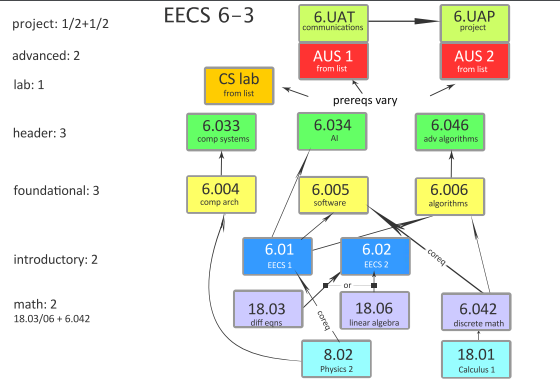
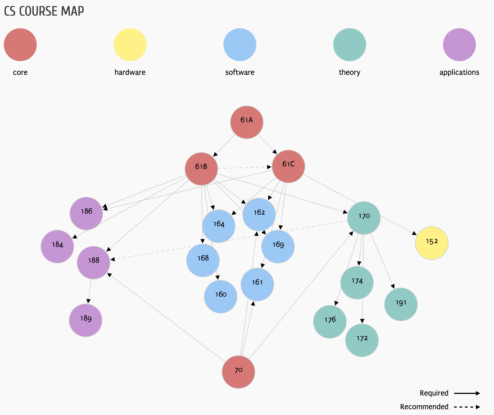

# Awesome CSMATH Courses

This is a personal repository I created for studying **Computer Science + Mathematics undergraduate courses from top U.S. universities**.  

The repo will contain:
- 📒 My own study notes  
- 📂 Some collected resources (papers, slides, links, etc.)  
- 🗺️ Course maps as references  

---

## 🎯 My Focus

Although the images here show the **full undergraduate roadmaps** (e.g., MIT EECS 6-3, UC Berkeley CS), my personal study path is **not to complete every listed course**.  

- I am primarily focusing on the **AI-oriented track** (machine learning, optimization, computer vision, NLP, etc.).  
- Some courses in the maps are **only used as references** for prerequisites and structure, but I will not study them in depth.  
- In addition to the courses shown in these images, I may also explore **other CS/Math courses** that are relevant to AI and research.  

---

## 🗺️ Reference Course Maps

### MIT EECS 6-3 (Computer Science and Engineering)

---

### UC Berkeley CS Course Map

---

## 📌 Purpose of This Repo

- Organize and track my **self-study journey**  
- Keep a structured **reference of course prerequisites**  
- Document my **AI-focused learning notes**  
- Collect additional **resources beyond the given course maps**  

---

💡 *This is not a strict curriculum but rather a flexible learning plan, inspired by the best U.S. undergraduate programs.*

